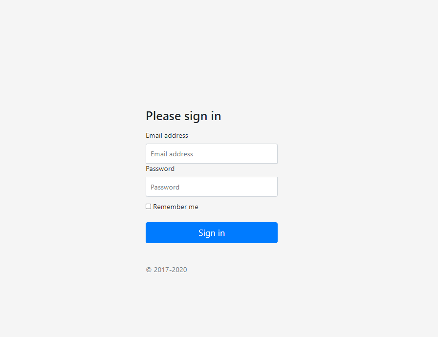
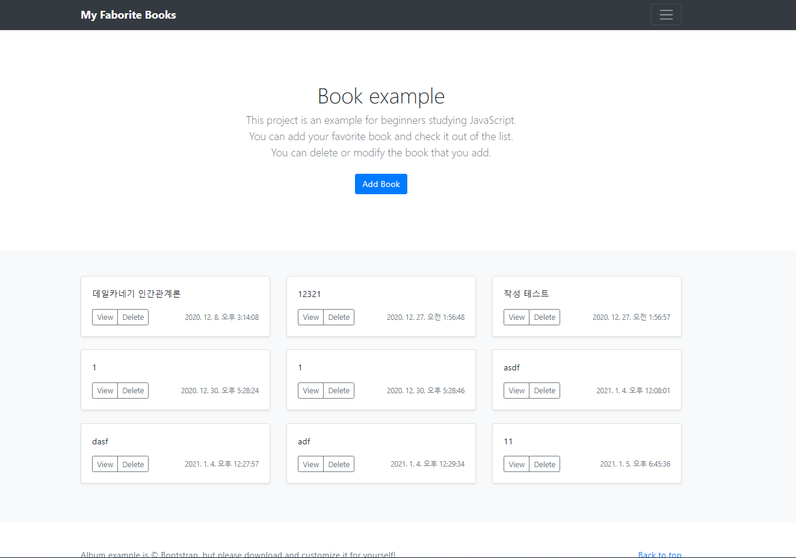
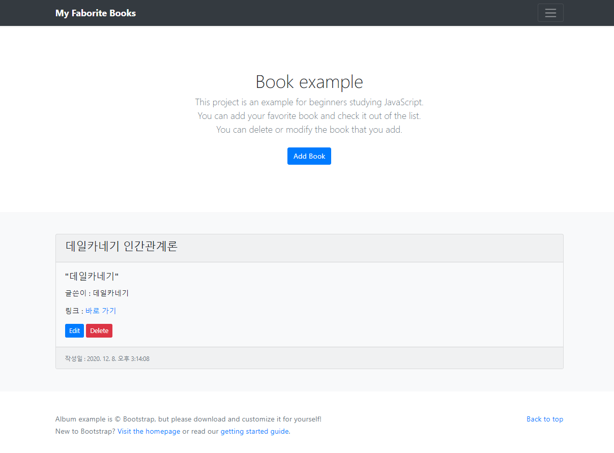
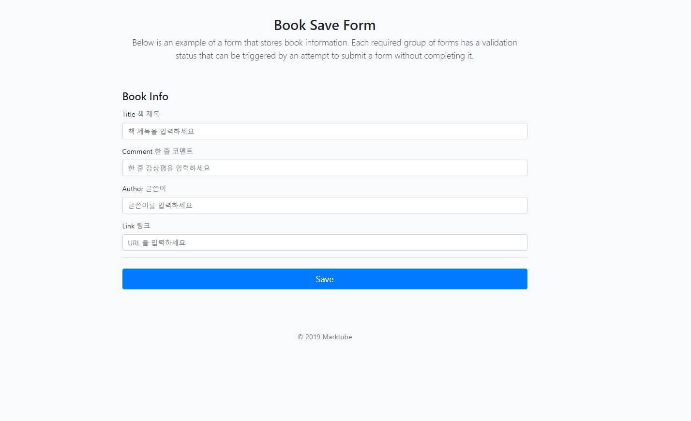
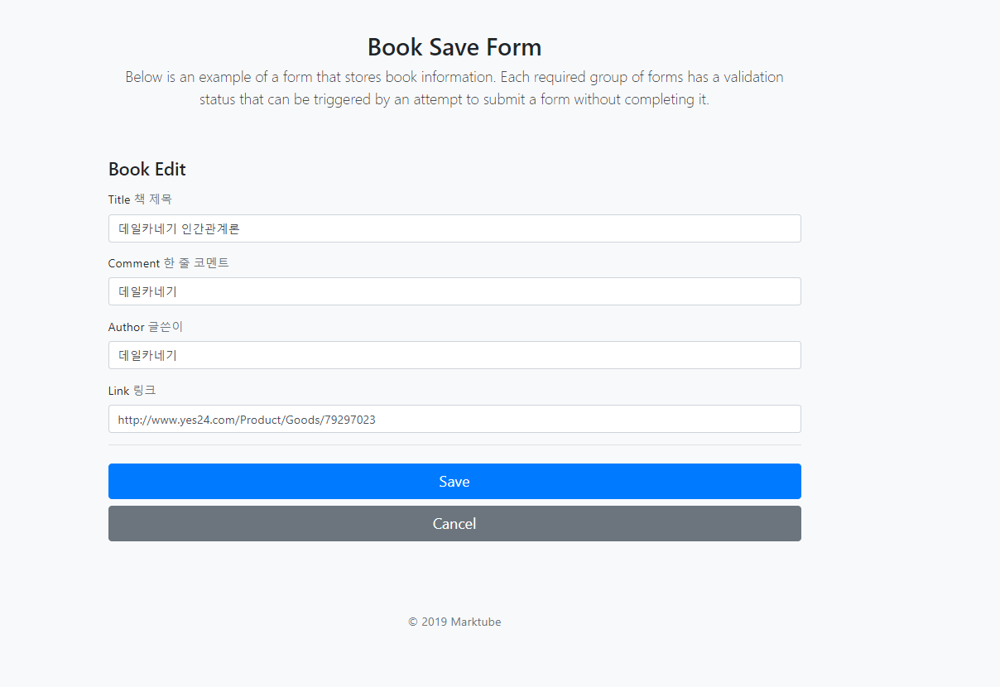

# Book list with login page - Axios and Localstorage
Reference(Fast campus Online JavaScript Project)

## Installation
Either through cloning with git or by using npm(the recommeded way):

```
npm i
```
And then you can click the html file to start or download the Live Server to load the website.
```
npm install -g live-server
```
On the right bottom of the VSC editor, you will be able to see the Go live button. 

## Links
This site was built using [Fast campus Online JavaScript Project](https://github.com/xid-mark/fc-js-project).

## Image:
### Login page

### Main page

### book-detail page

### add page

### edit page

